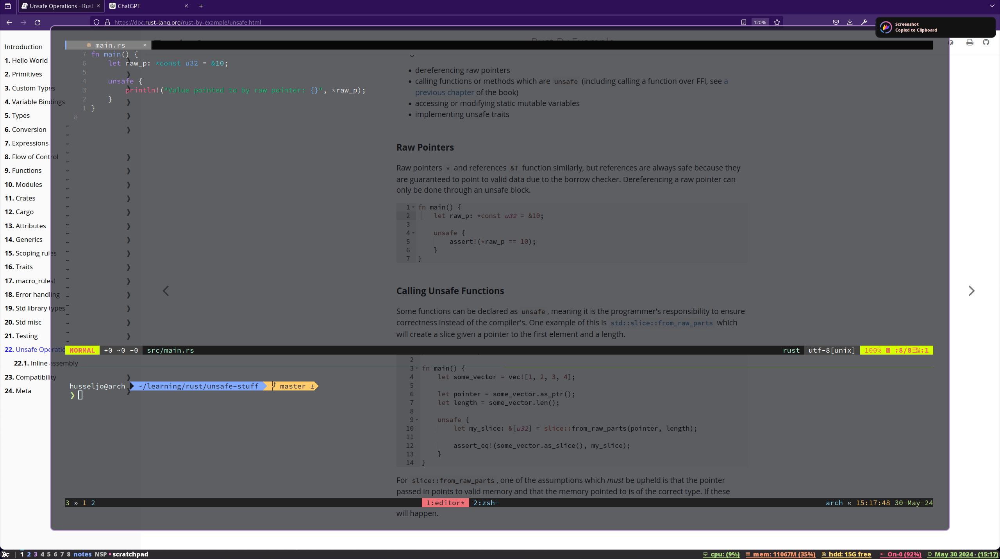
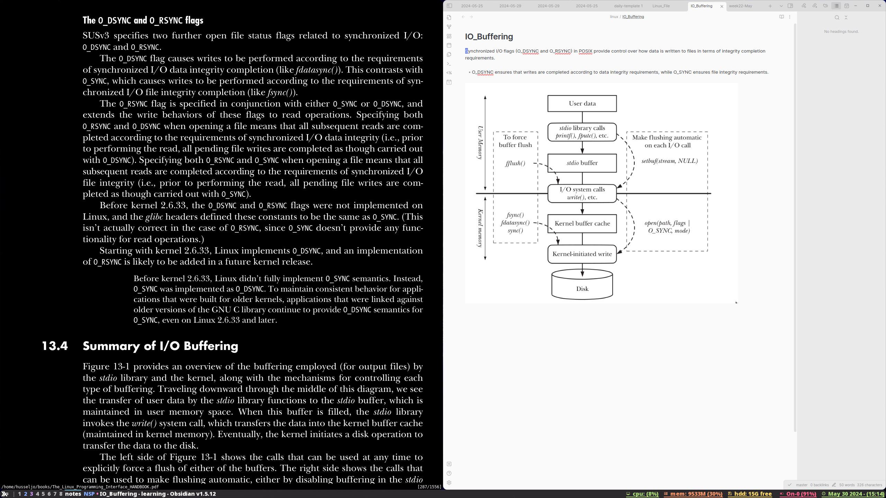

### Samples

## Dependencies

- [rofi](https://github.com/davatorium/rofi) +config
- [dunst](https://github.com/dunst-project/dunst) +config
- [maim](https://github.com/naelstrof/maim)
- [feh](https://github.com/derf/feh)
- [betterlockscreen](https://github.com/betterlockscreen/betterlockscreen)
- [greenclip](https://github.com/erebe/greenclip)
- pactl
- brightnessctl
- xclip

## some needed scripts (under `~/scripts`)

- inhibit_activate
- inhibit_deactivate
- powermenu.sh
- toggle_alacritty_opacity
- toggle_xmobar

## Programs I use (can be swapped):

- [alacritty](https://github.com/alacritty/alacritty)
- firefox-developer-edition
- [qutebrowser](https://github.com/qutebrowser/qutebrowser/)
- obsidian
