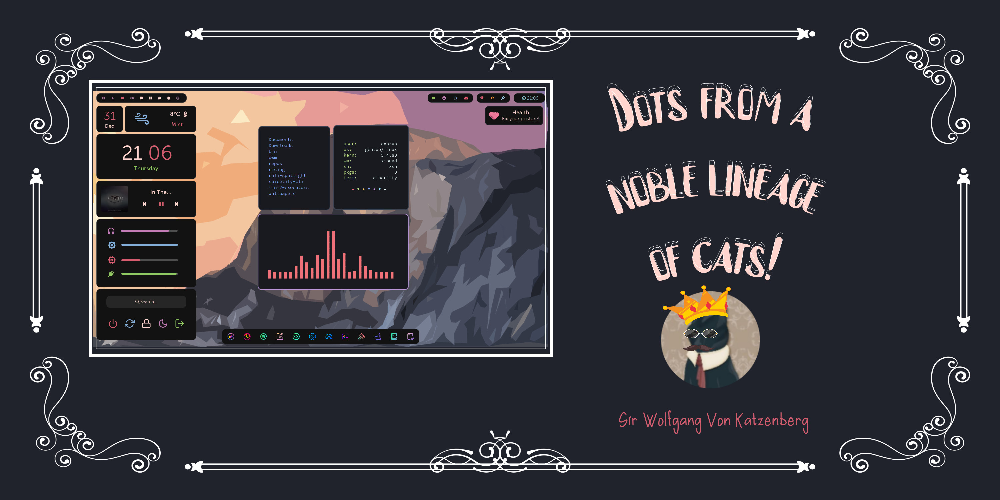

<h1 align="center">✨ Widgets go brr! ✨</h1>

<p align="center">
  <a href="https://github.com/Axarva/dotfiles-2.0/stargazers"></a>
  <a href="https://github.com/Axarva/dotfiles-2.0/issues"></a>
  <a href="https://github.com/Axarva/dotfiles-2.0/network/members"></a>
  <a href="https://github.com/Axarva/dotfiles-2.0/blob/main/LICENSE"></a>
</p>

## Table of Contents

- [About ⁉️](#about)
- [Gallery 📷](#gal)
- [Workflow 🖨️](#workflow)
- [Installation 🤵‍](#inst)
- [Dependencies 📊](#deps)
- [Troubleshooting 🔫](#trouble)

<a id="about"></a>

## Starring:


- **Note:** Check out the `modified` branch for a newer setup. Hope you like it!
- **xmonad** ⚽
- **eww** (Very wacky)
- **firefox** 🦊
- **rofi** 💈
- **tint2 ([This](https://github.com/Axarva/tint2-1) fork is the only supported fork.)** 🍫
- **Inhibitors** 👁️ (Inhibitors are cool stuff that prevent auto screen lock when you're watching a video or something)
- **Healthy stuff** ❤️ (Yeah, you get notifications to fix your posture and take a break)
- _Insert more stuff here_

Hello! Thank you for dropping by! 👋

These are my xmonad configurations, and they go brr! 🚀 (Let's stop that there).

If you're here, I suppose you want to be cloning this configuration, for which look at the Installation Section below. 👇

Even if you're not, just look through the gallery:

<a id="gal"></a>


<a id="workflow"></a>

## Workflow 🖨️

Workflow GIF: (This is a short one, for more goodies look at the links below)

(Also, compression made it look kinda bad, but I think it shows what it needs to)

<p align="center">
  
</p>

[Workflow Video by SavvyNik](https://www.youtube.com/watch?v=rMoUCnqhYfs) aka [@SavvyNik](https://github.com/SavvyNik)

[Workflow Video by Guilherme Moreno](https://www.youtube.com/watch?v=im9QKZSMUFQ) aka [@morenoled](https://github.com/morenoled)

## Installation 🤵‍

### For Arch Linux and it's derivatives (make sure you have git installed): 🌇

THIS MAKES BACKUPS TOO, SO YEAH. JUST DO IT. DO IT!

```bash
$ git clone https://github.com/Axarva/dotfiles-2.0.git
$ cd ./dotfiles-2.0
$ chmod +x ./install-on-arch.sh
$ ./install-on-arch.sh
$ sudo ln -s /usr/lib/libasan.so.8 /usr/lib/libasan.so.6 #This is here for tint2 to work.
```

That'll do the basic stuff. For a complete copy, look at the list of dependencies below.

AND DON'T FORGET TO READ WHAT'S WRITTEN AT THE END OF THE MAIN INSTALLATION SECTION [UP THERE](#inst). Further steps are specified there. (Yes. Absolutely needs to be shouty capitals.)

#### Going Ahead: Others Edition

You need to install the dependencies yourself, this script will add the fonts and the configs (and back up existing ones too):

```bash
$ git clone https://github.com/Axarva/dotfiles-2.0.git
$ cd ./dotfiles-2.0
$ chmod +x ./install-on-gentoo.sh
$ ./install-on-gentoo.sh
```

AND DON'T FORGET TO READ WHAT'S WRITTEN AT THE END OF THE MAIN INSTALLATION SECTION [UP THERE](#inst). Further steps are specified there. (Yes. Absolutely needs to be shouty capitals.)
<a id="deps"></a>

## Dependencies 📊

Here you go. Make sure you have em all.

- xmonad
- [eww](https://github.com/elkowar/eww) (ElKowar's Wacky Widgets, binary included, but I encourage you to build it yourself and put the binary in your ~/bin).
- firefox (Not exactly a dependency)
- rofi version 1.7.0 (Configs originally come from @adi1090x, been edited by me).
- tint2 (Please use [this fork](https://github.com/Axarva/tint2-1) ONLY, or issues will occur. Binaries provided already.)
- acpi
- Museo Sans Font by Adobe (I think it needs some sort of acount, but get it) Or just search for it on the web and get it somewhere
- [Nerd Font](https://github.com/ryanoasis/nerd-fonts/tree/master/patched-fonts/Iosevka) (I include some, but you can use any of your choice.)
- playerctl
- [brightnessctl](https://github.com/Hummer12007/brightnessctl)
- [candy-icons](https://github.com/EliverLara/candy-icons)
- dunst
- Spotify (for cover art, else edit the eww/scripts/getart script accordingly)
- An OpenWeatherMap Account, (view eww/scripts/getweather script for more info)
- feh
- NetworkManager
- greenclip
- alacritty
- picom (fork of ibhagwan or jonaburg)
- jq: Command line json parser (Needed for widgets)
- maim and xclip for screenshots
- mpv for low-battery sound playing (Not exactly necessary, you'll get the notification, but the sound depends on it.)
- _Might need to be updated, so please tell me_

<a id="trouble"></a>

## Troubleshooting 🔫

And here we are:

1. If xmonad doesn't build make sure you have the `xmonad-contrib` package.
2. Bar looks weird: Try editing it a bit using `~/bin/tint2conf`.
3. Alacritty configs are faulty: I'm not sure about this one, works perfectly fine for me.
4. Widgets positioning weird: I hardcoded them for a 1366x768 screen, will create others if I can
5. Fonts: GET THOSE FONTS!
6. **MAKE SURE YOUR `~/bin` DIRECTORY IS IN YOUR PATH, OR NOTHING WILL WORK!** (Yes. Absolutely needs to be shouty capitals.)
7. For instructions regarding use on VirtualMachine, please do check the `VM` folder of this repository.
8. Bars not showing on Arch Linux: `sudo ln -s /usr/lib/libasan.so.8 /usr/lib/libasan.so.6`
9. The workspace indicator bar issue has been solved through the binaries in my fork.
10. Anything else? Open up an issue.

<h1 align="center">🌟 Good Luck and Cheers! 🌟</h1>
